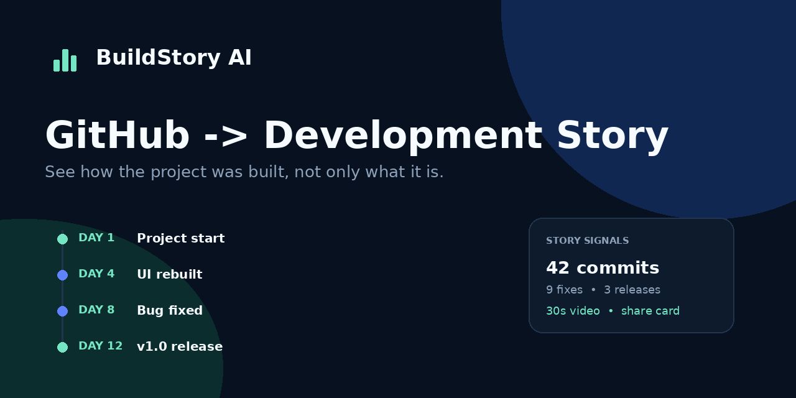

# BuildStory AI

**GitHub Repository URL 하나로 프로젝트의 개발 과정을 인터랙티브 스토리로 재구성하는 정적 웹서비스**입니다.

BuildStory AI는 공개 저장소의 커밋, 이슈/PR, 릴리스, 기여자, 언어, `package.json`을 읽고 다음을 생성합니다.

- `처음 → 시행착오 → 주요 기능 → 현재` 개발 타임라인
- Biggest Mistake (revert/fix 기반 휴리스틱)
- Most Expensive Feature (feature commit cluster 기반 휴리스틱)
- Bug Graveyard
- Architecture Evolution
- Dependency snapshot
- What I Learned 자동 추론
- 커밋 활동 기반 개발 시간 추정
- 사용자가 직접 표시하는 AI Contribution
- 공유 가능한 URL / JSON / PNG Story Card
- 브라우저에서 렌더링하는 30초 WebM 개발 영상

## Preview



첫 실행에서는 BuildStory 샘플 프로젝트가 표시됩니다. 실제 공개 GitHub 저장소 URL을 입력하면 같은 UI가 실제 데이터로 교체됩니다.

## Features

### 1. Public GitHub repository analysis

브라우저에서 GitHub REST API를 직접 호출합니다. 프론트엔드에 API Secret, Personal Access Token 또는 AI API Key를 포함하지 않습니다.

### 2. Development story timeline

커밋 메시지를 feature, fix, revert, UI/UX, refactor, performance, security, test, docs, release 등으로 분류한 뒤 우선순위와 시간 순서를 조합해 대표 마일스톤을 구성합니다.

### 3. Evidence-aware insights

추정치를 실제 측정값처럼 표현하지 않습니다. 개발 시간, Most Expensive Feature, Biggest Mistake에는 계산 방식이 휴리스틱임을 UI에서 명시합니다.

### 4. AI Contribution manual marking

GitHub 기록만으로 AI 작성 여부를 신뢰성 있게 판별하기 어렵기 때문에 사용자가 마일스톤별로 직접 표시합니다. 해당 값은 LocalStorage에 저장됩니다.

### 5. 30-second story video

Canvas + `MediaRecorder` + `captureStream()`을 이용해 서버 없이 30초 WebM을 생성합니다. 최신 Chrome/Edge에서 가장 안정적으로 동작합니다. MP4 인코딩은 GitHub Pages만으로 안정적인 크로스브라우저 구현이 어려워 MVP에서 의도적으로 제외했습니다.

## Tech Stack

- HTML5
- Modern CSS
- JavaScript ES Modules
- GitHub REST API
- Canvas API
- MediaRecorder API
- LocalStorage
- Node.js (dependency-free build/dev/test scripts)
- GitHub Actions + GitHub Pages

React/Vite 대신 **dependency-free 정적 아키텍처**를 선택했습니다. 현재 제품은 단일 화면의 데이터 분석 도구이며 서버 상태나 복잡한 라우팅이 없어, 번들러·프레임워크를 추가하지 않는 편이 GitHub Pages 성능과 유지보수에 더 단순합니다.

## Project Structure

```text
/
├─ public/
│  ├─ assets/
│  ├─ 404.html
│  ├─ manifest.webmanifest
│  ├─ robots.txt
│  └─ sitemap.xml
├─ src/
│  ├─ analysis/analyzer.js
│  ├─ api/github.js
│  ├─ data/demo.js
│  ├─ app.js
│  ├─ styles.css
│  ├─ utils.js
│  └─ video.js
├─ scripts/
│  ├─ build.mjs
│  ├─ check.mjs
│  └─ dev.mjs
├─ tests/
├─ .github/workflows/deploy.yml
├─ .nojekyll
├─ index.html
└─ package.json
```

## Local Development

Node.js 20 이상이 필요합니다. 외부 npm dependency는 없습니다.

```bash
npm run dev
```

브라우저에서 `http://localhost:5173/`을 엽니다.

## Test

```bash
npm test
```

## Build

```bash
npm run build
npm run check
```

기본 빌드는 `https://USERNAME.github.io/REPOSITORY`를 canonical placeholder 값으로 사용합니다. 실제 URL을 지정하려면:

```bash
SITE_URL="https://username.github.io/repository" npm run build
```

## GitHub Pages Deployment

1. 새 GitHub Repository를 만들고 이 프로젝트 전체를 push합니다.
2. 기본 branch 이름이 `main`인지 확인합니다.
3. Repository → **Settings → Pages**로 이동합니다.
4. Build and deployment의 Source를 **GitHub Actions**로 선택합니다.
5. `main`에 push하면 `.github/workflows/deploy.yml`이 테스트 → 빌드 → 정적 검증 → Pages 배포를 수행합니다.
6. 배포 URL은 보통 `https://USERNAME.github.io/REPOSITORY/`입니다.

Workflow의 `actions/configure-pages`가 실제 Pages `base_url`을 빌드 스크립트에 전달하므로 canonical, Open Graph URL, sitemap도 배포 주소에 맞게 생성됩니다.

## Repository Social Preview

GitHub Repository → **Settings → General → Social preview**에서 `public/assets/github-social.png`(1280×640)을 업로드하면 저장소 공유 카드로 사용할 수 있습니다. 웹사이트 Open Graph 이미지는 `public/assets/og-image.png`(1200×630)입니다.

## Configuration

사이트명/문구는 다음 파일에서 수정할 수 있습니다.

- 메타데이터: `index.html`
- UI copy: `src/app.js`
- Demo story: `src/data/demo.js`
- 분석 규칙: `src/analysis/analyzer.js`
- Design tokens: `src/styles.css` 상단 `:root`

## API Limits

인증하지 않은 GitHub REST API 요청은 IP 기준 rate limit의 영향을 받습니다. BuildStory는 한 저장소 분석 시 요청 수를 작게 유지하고, UI에 남은 호출량을 보관할 수 있는 구조로 작성되어 있습니다.

사용량이 커지면 브라우저에 Personal Access Token을 넣는 대신 다음 구조를 권장합니다.

```text
Browser
  ↓
Serverless API / GitHub App
  ↓
GitHub REST/GraphQL API
```

이 구조에서는 token을 서버 환경변수에만 보관할 수 있습니다.

## AI Model Extension

현재 GitHub Pages MVP는 API Key 없이도 완전히 동작하도록 규칙 기반 story engine을 사용합니다. GPT/Claude/Gemini를 추가할 때는 프론트엔드에서 모델 API를 직접 호출하지 말고 Serverless proxy를 추가하세요.

권장 확장 contract:

```text
POST /api/story
{
  repository,
  commits,
  issues,
  pulls,
  releases,
  currentAnalysis
}
```

서버는 모델 응답을 JSON schema로 검증한 뒤 브라우저에 반환하는 방식이 적합합니다.

## Custom Domain

GitHub Pages Settings에서 Custom domain을 등록한 뒤 HTTPS가 활성화되었는지 확인합니다. 고정 도메인을 저장소에 포함하려면 루트에 `CNAME` 파일을 추가할 수 있습니다.

Custom domain 사용 시 GitHub Actions의 Pages `base_url`이 해당 도메인을 반환하므로 별도 경로 수정 없이 메타데이터가 빌드됩니다.

## Security

- GitHub token / AI API key / password를 코드에 포함하지 않습니다.
- 외부 저장소의 텍스트는 HTML escape 후 렌더링합니다.
- URL 파서는 `github.com/{owner}/{repo}` 형식만 허용합니다.
- 앱은 public repository read-only 작업만 수행합니다.

## Browser Support

핵심 분석 기능은 최신 Chrome, Edge, Firefox, Safari에서 동작하도록 작성했습니다. 30초 WebM 내보내기는 브라우저의 MediaRecorder/WebM 지원 차이로 최신 Chrome/Edge를 권장합니다.

## License

MIT License. 자세한 내용은 `LICENSE`를 확인하세요.
